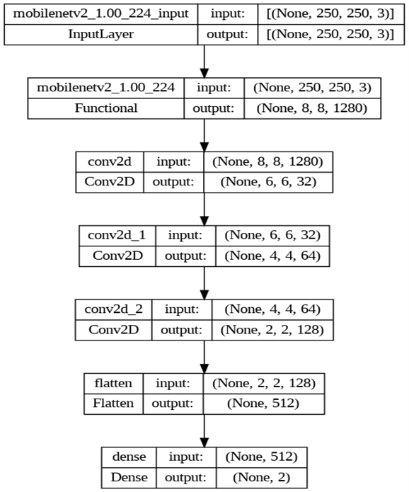
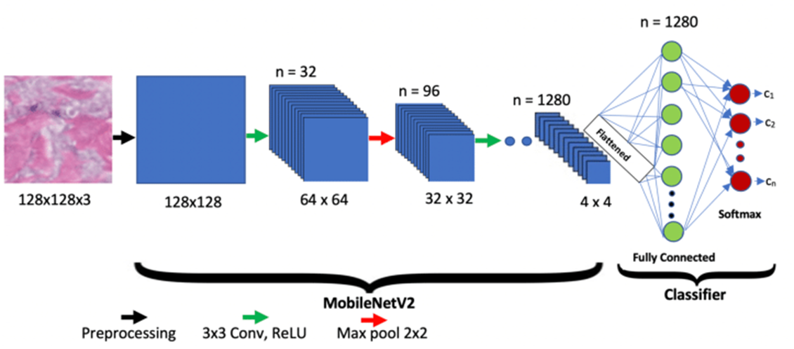
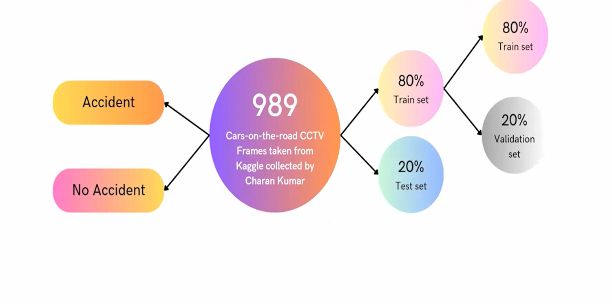
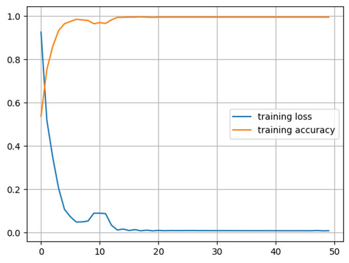
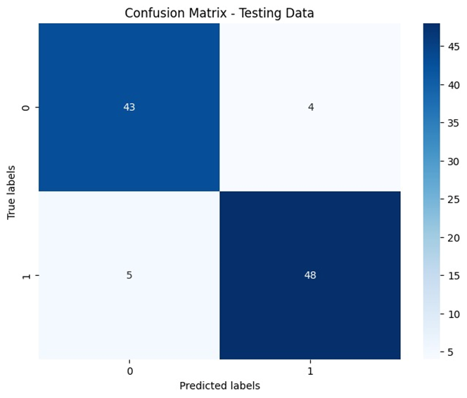
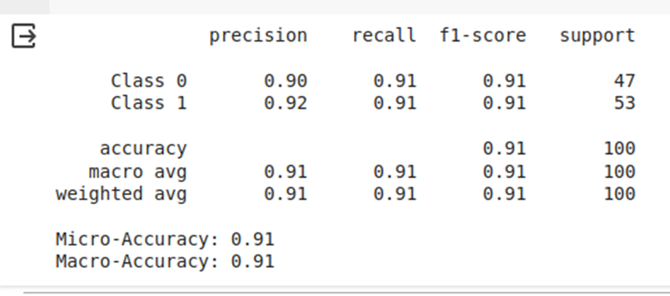

# Accident Detection using Convolutional Neural Network and MobileNetV2

## Introduction
This project aims to develop a system for detecting road accidents using Convolutional Neural Networks (CNN) and MobileNetV2. The primary objective is to quickly identify accidents and alert nearby hospitals to provide immediate medical assistance to the victims.

## Project Structure
- **assets/**: Contains all the images used in the project, including the flow diagram, dataset sample, CNN architecture, MobileNetV2, dataset description, training vs validation loss, confusion matrix, and results.

## Contents
1. [Project Overview](#project-overview)
2. [CNN Architecture](#cnn-architecture)
3. [MobileNetV2](#mobilenetv2)
4. [About the Dataset](#about-the-dataset)
5. [Training Loss vs Training Accuracy](#training-lossvs-training-accuracy)
6. [Confusion Matrix](#confusion-matrix)
7. [Results](#results)
8. [Conclusion](#conclusion)
9. [Future Scope](#future-scope)

## Project Overview
The rapid growth in the number of vehicles has led to an increase in road accidents. Timely medical intervention can significantly improve the survival chances of accident victims. This project leverages deep learning techniques to detect accidents and send alerts to nearby hospitals.

## CNN Architecture

The architecture of the Convolutional Neural Network used in the project.

## MobileNetV2

MobileNetV2 architecture is utilized for efficient accident detection.

## About the Dataset

Detailed information about the dataset, including the number of images, classes, and preprocessing steps.

## Training Loss vs Training Accuracy

The graph showing the training and validation loss over epochs, indicating the model's learning progress.

## Confusion Matrix

The confusion matrix representing the model's performance on the test set.

## Results

The final results of the model, including accuracy and other metrics.

## Conclusion
The proposed system demonstrates a high accuracy in detecting road accidents and can significantly reduce the time for emergency responders to reach the accident scene.

## Future Scope
Future work includes enhancing the robustness of the system, integrating additional sensor data, and developing a mobile application for seamless communication between accident victims, responders, and hospitals.

---

We hope this project contributes to improving road safety and saving lives by ensuring timely medical intervention for accident victims.

## Authors
- **Chowdhury Sabir Morshed** (Roll no-232IT009, National Institute of Technology, Surathkal, Karnataka, India)
- **Jai Narayan Singh** (Roll no-232IT016, National Institute of Technology, Surathkal, Karnataka, India)

## Acknowledgments
We would like to thank our advisor, Professor Dr.Dinesh Naik, for their guidance and support throughout this research project.
